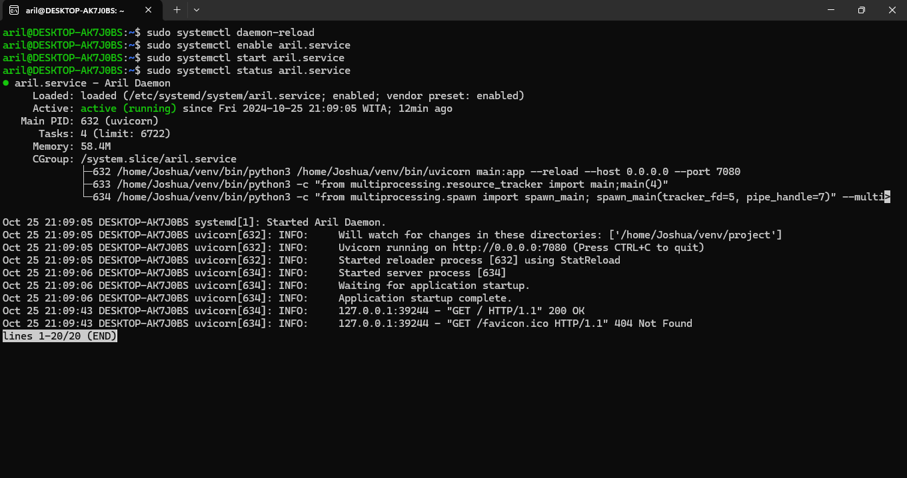

# Panduan Pembuatan Daemon Process
NIM: F1G123024  
Nama: Muhammad Aril Andrian

Berikut ini adalah tahapan pembuatan daemon process.

## Buat File .service
Masuk sebagai superuser, lalu jalankan perintah:
```bash
$ sudo touch /etc/systemd/system/aril.service
```

## Penulisan Script Konfigurasi .service
Buka file yang baru saja dibuat dan tuliskan konfigurasi berikut:
```ini
[Unit]
Description=Aril Daemon

[Service]
User=Joshua
Restart=always
WorkingDirectory=/home/Joshua/venv/project
Environment="PYTHONPATH=/home/Joshua/venv/lib/python3.10/site-packages"
ExecStart=/home/Joshua/venv/bin/uvicorn main:app --reload --host 0.0.0.0 --port 7080

[Install]
WantedBy=multi-user.target
```

## Penjelasan Singkat Mengenai Script Konfigurasi .service
**[Unit]**  
- **Description**: Menyediakan deskripsi singkat tentang service. Dalam kasus ini, service disebut "Aril Daemon".

**[Service]**  
- **User**: Menentukan pengguna yang akan menjalankan service ini, yaitu `Joshua`.
- **Restart**: Menentukan kebijakan restart service. `always` berarti service akan selalu restart jika keluar, terlepas dari status keluar.
- **WorkingDirectory**: Menetapkan direktori kerja untuk service. Dalam hal ini, service akan beroperasi di `/home/Joshua/venv/project`.
- **Environment**: Menentukan variabel lingkungan. `PYTHONPATH` diset untuk mencakup path ke package Python yang diperlukan, dalam hal ini di `lib/python3.10/site-packages`.
- **ExecStart**: Perintah yang dijalankan saat service dimulai. Ini menjalankan `uvicorn` untuk menjalankan aplikasi FastAPI yang didefinisikan dalam `main.py` pada port 7080, dengan opsi `--reload` untuk memuat ulang aplikasi saat ada perubahan kode, dan `--host 0.0.0.0` agar aplikasi dapat diakses dari semua alamat IP.

**[Install]**  
- **WantedBy**: Menentukan target di mana service ini akan dimuat. `multi-user.target` berarti service akan aktif saat sistem berada dalam mode multi-user (umumnya saat booting normal).

## Jalankan Perintah Daemon
```bash
$ sudo systemctl daemon-reload 
$ sudo systemctl enable aril.service 
$ sudo systemctl start aril.service
$ sudo systemctl status aril.service
```

## Bukti Daemon

