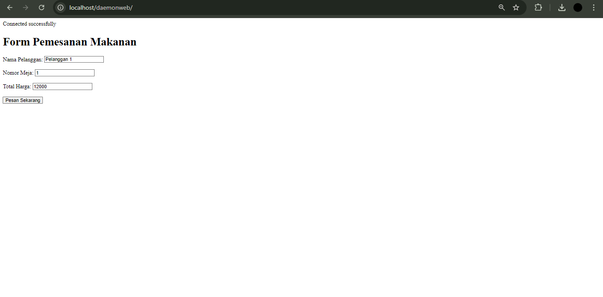
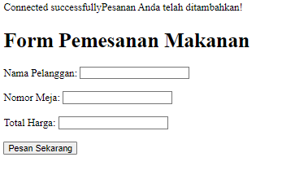
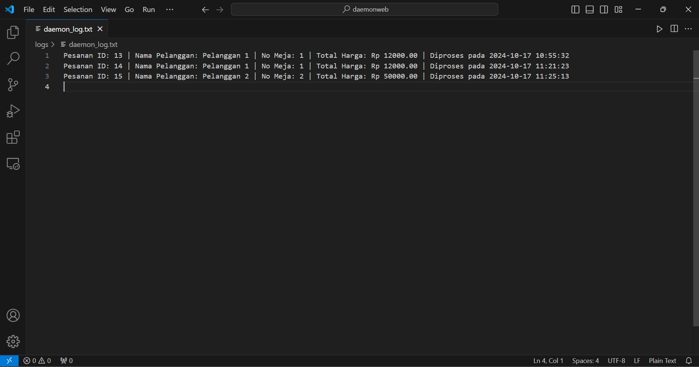
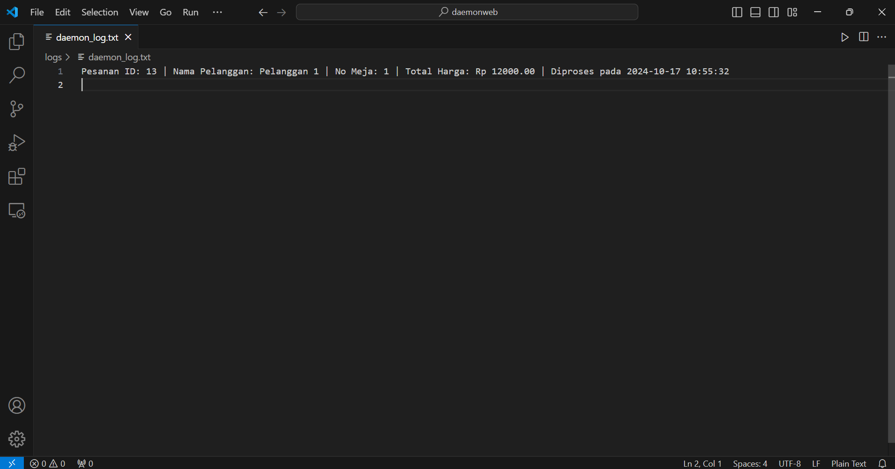

# Proses Menjalankan Website Menggunakan Daemon Process dengan Laragon

## 1. Pendahuluan
Website yang dibangun dapat memanfaatkan **daemon process** untuk menangani tugas-tugas otomatis yang perlu berjalan di latar belakang. Daemon process dapat digunakan untuk memproses data, mengelola antrian pesanan, atau menjalankan fungsi tertentu secara berkala tanpa interaksi langsung dari pengguna. Dalam panduan ini, kita akan menggunakan **Laragon** sebagai lingkungan pengembangan.

## 2. Persiapan
Sebelum memulai, pastikan Anda telah menginstal dan mengkonfigurasi lingkungan pengembangan seperti **Laragon**. Pastikan juga database Anda sudah siap dan terhubung dengan benar.

### 2.1. Instalasi Laragon
1. Unduh dan instal **Laragon** dari situs resminya.
2. Jalankan Laragon dan pastikan layanan Apache dan MySQL berjalan.

## 3. Struktur Proyek
Buat struktur folder proyek Anda sebagai berikut:
```
C:\laragon\www\mywebsite    
    ├── connection   
    │   └── koneksi.php
    ├── daemon
    |   └── daemon_process.php
    ├── logs 
    |   └── daemon_log.txt
    └── index.php
```

## 4. Membuat Daemon Process
Dalam file `daemon_process.php`, tuliskan logika untuk mengelola tugas latar belakang, misalnya memproses pesanan. Contoh kode untuk daemon process:
```php
<?php
include('../connection/koneksi.php');

// Pastikan folder logs ada
if (!file_exists('../logs')) {
    mkdir('../logs', 0777, true);
}

while (true) {
    // Ambil pesanan yang belum diproses
    $stmt = $db->prepare("SELECT * FROM orders WHERE status = 'belum diproses'");
    $stmt->execute();
    $orders = $stmt->fetchAll();

    foreach ($orders as $order) {
        // Proses pesanan (misalnya: ubah status pesanan)
        $stmt_update = $db->prepare("UPDATE orders SET status = 'diproses' WHERE id = ?");
        $stmt_update->execute([$order['id']]);

        // Dapatkan informasi tambahan untuk log
        $customerName = isset($order['nama_pelanggan']) ? $order['nama_pelanggan'] : 'Tidak Diketahui'; // Kolom yang benar
        $tableNumber = isset($order['nomor_meja']) ? $order['nomor_meja'] : 'Tidak Diketahui'; // Kolom yang benar
        $totalPrice = isset($order['total_harga']) ? $order['total_harga'] : 0; // Kolom yang benar

        // Log aktivitas pemrosesan
        $logMessage = "Pesanan ID: ".$order['id']." | Nama Pelanggan: ".$customerName." | No Meja: ".$tableNumber." | Total Harga: Rp ".$totalPrice." | Diproses pada ".date('Y-m-d H:i:s')."\n";
        
        // Menulis log
        file_put_contents($logFile, $logMessage, FILE_APPEND);
        
        // Output ke terminal (opsional)
        echo $logMessage;
    }

    // Tunggu 10 detik sebelum memeriksa lagi
    sleep(10);
}
?>

```

## 5. Menjalankan Daemon Process
1. Buka command line di Laragon.
2. Arahkan ke direktori proyek Anda:
   ```bash
   cd C:\laragon\www\mywebsite\daemon
   ```
3. Jalankan daemon process dengan perintah:
   ```bash
   php daemon_process.php
   ```
4. Pastikan daemon process berjalan di latar belakang dan dapat memproses pesanan secara otomatis.

## 6. Memantau Log
Log aktivitas daemon process akan disimpan di `logs/daemon_log.txt`. Anda bisa membuka file ini untuk melihat pesan terkait pemrosesan pesanan yang telah dilakukan oleh daemon process.

## 7.Bukti Screenshoot Program Berhasil Berjalan

## Tampilan Website


## Berhasil Membuat Pesanan


## Daemon Process Menampilkan Log Pesanan

