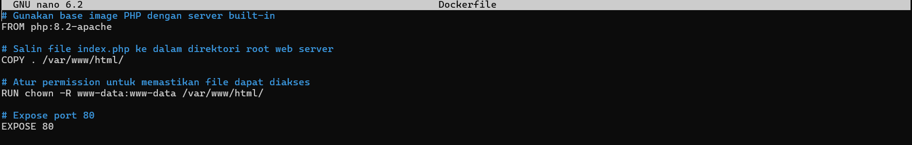
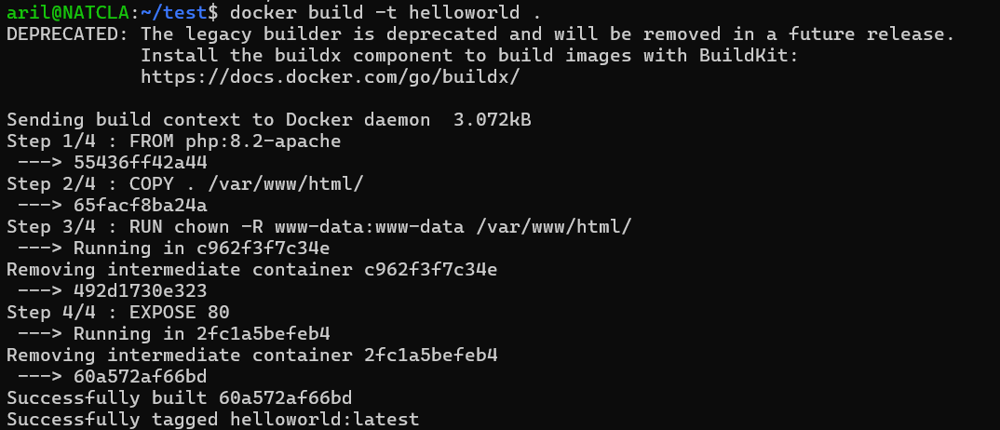
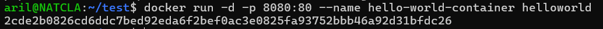
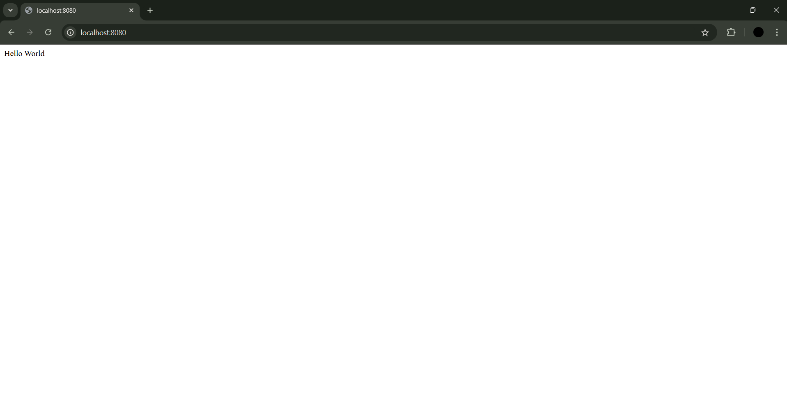
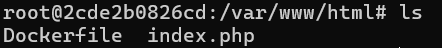
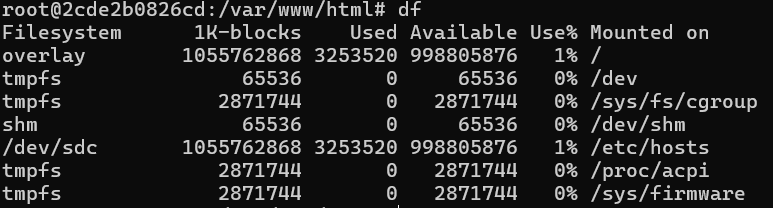
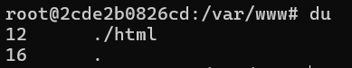
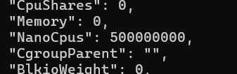

# **Tahapan Menjalankan Docker di WSL Ubuntu**
Berikut adalah tahapan menjalankan Docker di WSL Ubuntu.

## **1. Menginstall Docker pada WSL**
### 1.1 Mengupdate apt dan menginstall Docker
```bash
sudo apt update && sudo apt install docker.io
```

### 1.2 Mengecek Instalasi
```bash
docker --version
```
**Output:**


---

## **2. Membuat Dockerfile dan Program yang Akan Digunakan**
### 2.1 Membuat Folder Baru dan Masuk ke Dalam Foldernya
Gunakan perintah berikut untuk membuat direktori baru:
```bash
mkdir docker-project
cd docker-project
```

### 2.2 Membuat Dockerfile dan `index.php`
#### Membuat file `Dockerfile`
```bash
touch Dockerfile
```
Edit file `Dockerfile` menggunakan:
```bash
nano Dockerfile
```
Isi file `Dockerfile` dengan:
```dockerfile
# Gunakan base image PHP dengan server built-in
FROM php:8.2-apache

# Salin file index.php ke dalam direktori root web server
COPY . /var/www/html/

# Atur permission untuk memastikan file dapat diakses
RUN chown -R www-data:www-data /var/www/html/

# Expose port 80
EXPOSE 80
```
**Output:**



#### Membuat file `index.php`
```bash
touch index.php
```
Isi file `index.php` dengan:
```php
<?php
echo "Hello World";
?>
```

---

## **3. Build Docker Image dan Jalankan Container**
### 3.1 Build Docker Image
Build image dengan nama `helloworld`:
```bash
docker build -t helloworld .
```
**Output:**



### 3.2 Jalankan Container
Jalankan container dengan nama image `helloworld`:
```bash
docker run -d -p 8080:80 --name hello-world-container helloworld
```
**Output:**



### 3.3 Membuka Browser untuk Memeriksa Aplikasi
Akses aplikasi melalui browser:

`http://localhost:8080`

**Output:**



---

## **4. Bedah Container**
Berikut adalah beberapa perintah Linux yang digunakan dalam konteks Docker:

### 4.1 Perintah `ls`
Digunakan untuk menampilkan daftar file dan direktori:
```bash
ls
```
**Output:**



### 4.2 Perintah `df`
Digunakan untuk menampilkan informasi tentang penggunaan ruang disk:
```bash
df
```
**Output:**



### 4.3 Perintah `du`
Digunakan untuk melihat penggunaan ruang disk oleh file atau direktori:
```bash
du
```
**Output:**



### 4.4 Perintah `rm`
Digunakan untuk menghapus file:
```bash
rm index.php
```

### 4.5 Perintah `touch`
Digunakan untuk membuat file baru:
```bash
touch index.php
```

### 4.6 Perintah `nano`
Digunakan untuk mengedit file:
```bash
nano index.php
```

---

## **5. Optimisasi Resource**
Berikut adalah langkah-langkah untuk membatasi penggunaan resource:

### 5.1 Membatasi Penggunaan CPU
Jalankan container dengan pembatasan CPU:
```bash
docker run -d -p 8080:80 --cpus="0.5" helloworld
```
**Output (inspect):**



### 5.2 Membatasi Penggunaan Memory
Jalankan container dengan pembatasan memori:
```bash
docker run -d -p 8080:80 --memory="200mb" helloworld
```
**Output (inspect):**


